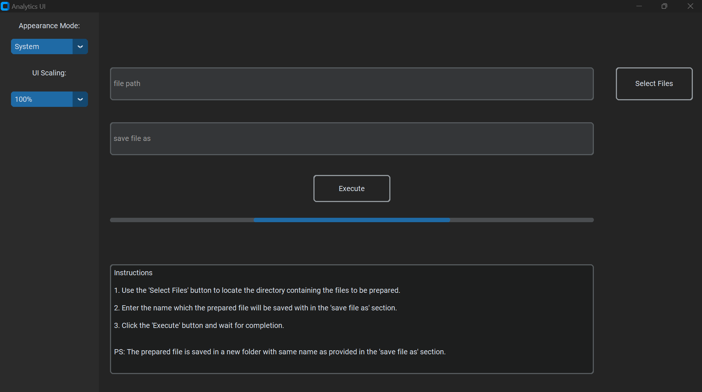
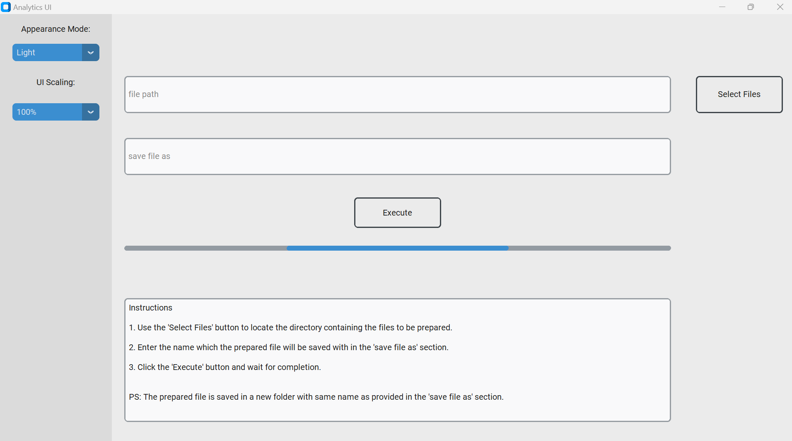

# Analytics_UI
A software UI built to eliminate recurring manual operations in data analysis. Current version only performs changes on
a particular column **DATETIME**. Further upgrades will include different functionalities as:\
1. removing or replacing null/missing values
2. renaming columns
3. changing data types
4. feature engineering - creating new columns from existing columns
5. concatenating files
6. saving final dataset

## UI
The software UI takes the system default theme, but can always be switched between **light** and **dark** themes.

#### Dark Theme

#### Light Theme

